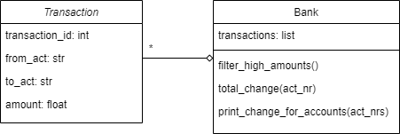

# Data Processing and Representations Exam

This is a digital exam. The exam consists of programming exercises that are purely based on input, output, and calculations. You will use these exercises to show that you can write a data processing program from scratch using tools covered in this course.

During the exam, **you are allowed use the internet and the code you have written for the PDP and DPR modules**. You are obviously not allowed to message other students, so make sure any and all messaging applications are closed for the entire duration of the exam. You are also not allowed to use ChatGPT or similar tools that can write code for you. The only allowed tools are an editor with your code, possibly with code from earlier assignments, your terminal and a browser for searching for other coding resources and documentation.

_You will not be graded on design, but only on the correctness of your code_ and whether you met the requirements. You do not have to comment your code, nor do you have to abide by any other styling rules (though this can greatly help you understand your code).

This exam consists of 3 parts. Each of the parts can be made separately and are fully independent of each other.

## Rules

- Finish all exercises in a file named `exam.py` and submit this file
- Define any functions and/or classes you write at the top of the file, and add the provided tests at the bottom of the file in order of the exercises.
- Make sure the provided tests are *all* printed (or shown) when running your program. Separate the prints for each exercise with an extra print like `print("\n=== Exercise 1 ===")`, so it is clear which output belongs to which exercise.
- Not all exercises need to be perfect to pass the exam. If you do not know how to proceed, describe what you want your code to do.
- You are allowed use the internet and the code you have written for the PDP and DPR modules
- You are *not* allowed to contact other students
- You are *not* allowed to use ChatGPT or similar tools that can write code for you.

*Before you leave the exam room, check with us that your submission was correctly submitted!*

# The Exam

## Part 1: OOP

A bank system asks you to implement their new transaction database. You will implement two classes: `Transaction` and `Bank`. `Transaction` is a class that contains all relevant information about a transaction: its identifier `transaction_id`, the account that the money is taken from `from_act`, the account that the money is sent to `to_act`, and the `amount` of money that is sent. The `Bank` class is a container for a list of `transactions` that implements methods to filter for large transactions, calculate the change in balance for an account, and print the change in balance for a list of accounts.

The following UML describes these classes and their relation:

Implement `Transaction` with the following method:

- `__init__(transaction_id, from_act, to_act, amount)`: create a new instance with the information provided by the parameters.

Implement `Bank` with the following methods:

- `__init__(transactions)`: create a new instance with the transactions provided as a parameter.
- `filter_high_amounts()`: return a list of all transactions that transferred over 1000 dollars.
- `total_change(act_nr)`: for the given account number (`act_nr`), return the change in money for that account as a float. This can be calculated by adding all the incomming transactions, and deducting all the outgoing transactions, for that specific account. Together this should indicate the total change in account balance from all the transactions for that account number.
- `print_change_for_accounts(self, act_nrs)`: For a list of accounts (`act_nrs`), print the total change in account balance from all the transactions for each account in the `act_nrs` list.

Have a look at this example:

    transactions = [Transaction(45, 'BE4567', 'NL9384', 115),
                    Transaction(42, 'NL1234', 'BE4567', 621),
                    Transaction(71, 'SP2398', 'NL1234', 567),
                    Transaction(130, 'NL9384', 'NL1234', 1213),
                    Transaction(62, 'NL1234', 'NL3394', 75),
                    Transaction(49, 'BE4567', 'NL9384', 99),
                    Transaction(33, 'NL3394', 'BE4567', 65),
                    Transaction(33, 'NL1234', 'NL0010', 517),
                    Transaction(55, 'NL1234', 'NL0010', 469),
                    Transaction(20, 'NL1234', 'NL0010', 728),
                    Transaction(53, 'NL1234', 'NL9384', 1393),
                    Transaction(33, 'SP2398', 'BE4567', 849),
                    Transaction(22, 'NL1234', 'NL9384', 992),
                    Transaction(40, 'NL0010', 'NL3394', 1235),
                    Transaction(52, 'NL9384', 'NL0010', 1477),
                    Transaction(31, 'NL1234', 'NL9384', 1393),
                    Transaction(127, 'BE4567', 'NL0010', 705),
                    Transaction(115, 'SP2398', 'NL1234', 440),
                    Transaction(39, 'SP2398', 'NL0010', 217),
                    Transaction(106, 'SP2398', 'NL0010', 1335)]

    ing_bank = Bank(transactions)
    first_transaction = ing_bank.transactions[0]

    print('The first transaction is:')
    print(f'TID {first_transaction.transaction_id}: ${first_transaction.amount} from {first_transaction.from_act} to {first_transaction.to_act}')
    print()

    high_amounts = ing_bank.filter_high_amounts()
    print(f'There are {len(high_amounts)} transactions that transfer over $1000!')
    print(f'Their TIDs are: {[t.transaction_id for t in high_amounts]}.')
    print()

    print(f'The total change for account NL3394 is ${ing_bank.total_change("NL3394")}')
    print()

    customers = ['NL1234', 'NL3394', 'NL9384', 'SP2398', 'NL0010', 'BE4567']
    ing_bank.print_change_for_accounts(customers)

Which should give the following result:

    The first transaction is:
    TID 45: $115 from BE4567 to NL9384

    There are 6 transactions that transfer over $1000!
    Their TIDs are: [130, 53, 40, 52, 31, 106].

    The total change for account NL3394 is $1245

    NL1234 changed by $-3968
    NL3394 changed by $1245
    NL9384 changed by $1302
    SP2398 changed by $-3408
    NL0010 changed by $4213
    BE4567 changed by $616

## Part 2: Pandas

For this assignment you need to use the file [film.csv](film.csv). This file contains data on a set of movies from the 1900s. The file contains the following data:

    Year;Length;Title;Subject;Actor;Actress;Director;Popularity;Awards
    1990;111.0;Tie Me Up! Tie Me Down!;Comedy;Banderas, Antonio;Abril, Victoria;Almodvar, Pedro;68.0;No
    1991;113.0;High Heels;Comedy;Bos, Miguel;Abril, Victoria;Almodvar, Pedro;68.0;No
    1983;104.0;Dead Zone, The;Horror;Walken, Christopher;Adams, Brooke;Cronenberg, David;79.0;No
    ...
    1988;78.0;Hot Money;Drama;Welles, Orson;;;19.0;No
    1977;75.0;Comedy Tonight;Comedy;Williams, Robin;;;18.0;No
    1991;65.0;Robin Williams;Comedy;Williams, Robin;;;4.0;No

As you can see, the data fields are separated by a **semicolon** and contain the following information:

1. Year of release
2. Duration in minutes
3. Title of the movie
4. Genre
5. The name of the lead actor
6. The name of the lead actress
7. The name of the director
8. The popularity (a float from 0 to 100)
9. Whether the movie was awarded (Yes/No)

#### Exercise 1

Load the data into a `DataFrame` named `df` using `pandas`. Print the dataframe and make sure your result has 1128 rows and 9 columns:

          Year  Length  ... Popularity Awards
    0     1990   111.0  ...       68.0     No
    1     1991   113.0  ...       68.0     No
    2     1983   104.0  ...       79.0     No
    3     1979   122.0  ...        6.0     No
    4     1978    94.0  ...       14.0     No
    ...    ...     ...  ...        ...    ...
    1123  1975    93.0  ...       85.0     No
    1124  1949    90.0  ...       57.0     No
    1125  1987   103.0  ...       69.0     No
    1126  1947    87.0  ...       17.0     No
    1127  1990    92.0  ...       18.0     No

    [1128 rows x 9 columns]

#### Exercise 2

Now that the `DataFrame` has been loaded, we will do some data transformations.

Add a new column to `df` named `'Demidecade'` that, for every movie, determines which 5 year period that movie was released in. For example, for a movie that was released in `1964` this column should contain `1960`, and for a movie released in `1997` this column should contain `1995`.

Print the resulting dataframe. It should look something like this:

          Year  Length  ... Awards Demidecade
    0     1990   111.0  ...     No       1990
    1     1991   113.0  ...     No       1990
    2     1983   104.0  ...     No       1980
    3     1979   122.0  ...     No       1975
    4     1978    94.0  ...     No       1975
    ...    ...     ...  ...    ...        ...
    1123  1975    93.0  ...     No       1975
    1124  1949    90.0  ...     No       1945
    1125  1987   103.0  ...     No       1985
    1126  1947    87.0  ...     No       1945
    1127  1990    92.0  ...     No       1990

    [1128 rows x 10 columns]

#### Exercise 3

Now create a `Series` named `duration_demidecade` that, for every demi-decade (5 year period) in the dataset, shows the average duration of movies released in that demi-decade rounded to the nearest minute. Your result should look something like this:

    Demidecade
    1920    102.0
    1925     99.0
    1930     88.0
    1935    102.0
    1940     94.0
    1945     97.0
    1950    100.0
    1955    109.0
    1960    121.0
    1965    117.0
    1970    112.0
    1975    117.0
    1980    111.0
    1985    105.0
    1990    109.0
    1995    102.0
    Name: Length, dtype: float64

#### Exercise 4

Write code that can find the demi-decade that had the longest movies on average. Print the result as follows:

    The 5 year period with the longest movies on average was: XXXX

#### Exercise 5

Find how many movies that are in our dataset were released in the demi-decade 1965. Print the result as follows:

    The 5 year period from 1965 had YYYY movies

#### Exercise 6

The dataset contains a lot of names that are formatted as `'<lastname>, <firstname>'`. We want to reformat these names to make them more readable. Change every name in the columns `'Actor', 'Actress', 'Director'` to be in the new format `<firstname> <lastname>`.

Print the first 5 entries from the columns `'Actor', 'Actress', 'Director'`:

                    Actor         Actress          Director
    0    Antonio Banderas  Victoria Abril    Pedro Almodvar
    1          Miguel Bos  Victoria Abril    Pedro Almodvar
    2  Christopher Walken    Brooke Adams  David Cronenberg
    3        Sean Connery    Brooke Adams    Richard Lester
    4        Richard Gere    Brooke Adams   Terrence Malick

## Part 3: Built-in data structures

### Phone book

For this assignment you'll write a few functions to work with some phone book data. This phone book is built using a *dictionary of dictionaries*, where the outer dictionary can be used to search on **last name** as a key, and its corresponding value is an inner dictionary of **first names** and their **phone numbers**. As it is possible for several people to have the same first and last name, the values of the inner dictionary are all *lists* of phone numbers, which will contain several phone numbers if there are multiple people with that same name.

Below is the example phone book we'll be working with for the assignment

    phone_book = {"White":
                     {"Harvey": [5306],
                      "Larry": [2116],
                      "John": [7470, 4279, 5122]},
                 "Orange":
                     {"Tim": [7988],
                      "Jack": [2994, 9808],
                      "James": [3358],
                      "Freddy": [9024]},
                 "Blonde":
                     {"Vic": [6027],
                      "Micheal": [3397],
                      "Jack": [9299]},
                 "Pink":
                     {"Edward": [1380],
                      "Quentin": [5461],
                      "Jack": [3768],
                      "Steve": [5060]},
                 }

You should copy-paste this example in your own code file. Make sure you understand the structure of the phonebook before moving on to the first assignment.

#### Excercise 1

Write a function `add_number(phone_book, first_name, last_name, phone_number)` that adds the `phone_number` of a person with the given `first_name` and `last_name` to the `phone_book`. This function should modify the original `phone_book` and return the modified copy. Note that is possible that a person with that same name might already be in the phone book, in which case the number should be added to the existing list. If the first and/or last name don't already occur in the phone book, they should be added as entries in the phone book.

You can test your code using

    add_number(phone_book, 'James', 'Orange', 8796)
    add_number(phone_book, 'Calvin', 'Blue', 1109)

    print(phone_book)

which should print something like

    {'White':
        {'Harvey': [5306],
         'Larry': [2116],
         'John': [7470, 4279, 5122]},
     'Orange':
         {'Tim': [7988],
          'Jack': [2994, 9808],
          'James': [3358, 8796],
          'Freddy': [9024]},
     'Blonde':
         {'Vic': [6027],
          'Micheal': [3397],
          'Jack': [9299]},
     'Pink':
         {'Edward': [1380],
          'Quentin': [5461],
          'Jack': [3768],
          'Steve': [5060]},
     'Blue':
         {'Calvin': [1109]}}

> Note that order of the dictionary keys, and the formatting of your printing do not need to be the same. Only the key-value mappings of the dictionaries needs to match here.

#### Excercise 2

Next, write the function `build_number_list(phone_book)` that take as input a `phone_book` and returns a list of tuples each containing the *first name*, *last name* and *phone number* of all the individuals in the phone book. So this function will need convert the dictionary of dictionaries to a single list of tuples with all the individuals in the phone book. Note that order of the of the names does not matter, as long as all the individuals from the phone book are listed.

If you call this function on your example phone book using `build_number_list(phone_book)`, you should get an output similar to this

    [('Harvey', 'White', 5306),
     ('Larry', 'White', 2116),
     ('John', 'White', 7470),
     ('John', 'White', 4279),
     ('John', 'White', 5122),
     ('Tim', 'Orange', 7988),
     ('Jack', 'Orange', 2994),
     ('Jack', 'Orange', 9808),
     ('James', 'Orange', 3358),
     ('James', 'Orange', 8796),
     ('Freddy', 'Orange', 9024),
     ('Vic', 'Blonde', 6027),
     ('Micheal', 'Blonde', 3397),
     ('Jack', 'Blonde', 9299),
     ('Edward', 'Pink', 1380),
     ('Quentin', 'Pink', 5461),
     ('Jack', 'Pink', 3768),
     ('Steve', 'Pink', 5060),
     ('Calvin', 'Blue', 1109)]

### Excercise 3

Finally, write a function `find_first_name(phone_book, first_name)` that takes a `phone_book` and finds all of the people with that `first_name` and their phone numbers. The function should return a new dictionary, where the keys are the different *last names* belonging to that first name, and the values are the lists of *phone numbers* belonging to people with that first name and last name.

If you test your code using the first name `Jack` by calling `find_first_name(phone_book, 'Jack')`, you should get the following output

    {'Orange': [2994, 9808], 'Blonde': [9299], 'Pink': [3768]}
