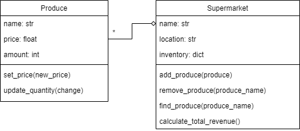

# Data Processing and Representations Exam

This is a digital exam. The exam consists of programming exercises that are purely based on input, output, and calculations. You will use these exercises to show that you can write a data processing program from scratch using tools covered in this course.

During the exam, **you are allowed use the internet and the code you have written for the PDP and DPR modules**. You are obviously not allowed to message other students, so make sure any and all messaging applications are closed for the entire duration of the exam. You are also not allowed to use ChatGPT or similar tools that can write code for you. The only allowed tools are an editor with your code, possibly with code from earlier assignments, your terminal and a browser for searching for other coding resources and documentation.

_You will not be graded on design, but only on the correctness of your code_ and whether you met the requirements. You do not have to comment your code, nor do you have to abide by any other styling rules (though this can greatly help you understand your code).

This exam consists of 3 parts. Each of the parts can be made separately and are fully independent of each other.

## Rules

- Finish all exercises in a file named `exam.py` and submit this file
- Define any functions and/or classes you write at the top of the file, and add the provided tests at the bottom of the file in order of the exercises.
- Make sure the provided tests are *all* printed (or shown) when running your program. Separate the prints for each exercise with an extra print like `print("\n=== Exercise 1 ===")`, so it is clear which output belongs to which exercise.
- Not all exercises need to be perfect to pass the exam. If you do not know how to proceed, describe what you want your code to do.
- You are allowed use the internet and the code you have written for the PDP and DPR modules
- You are *not* allowed to contact other students
- You are *not* allowed to use ChatGPT or similar tools that can write code for you.

*Before you leave the exam room, check with us that your submission was correctly submitted!*

# The Exam

## Part 1: OOP

You are tasked with creating a basic representation of a supermarket and its produce items. You will implement two classes: `Produce` and `Supermarket`. The `Produce` class represents an item in the supermarket and contains information such as its name, price, and available quantity. The `Supermarket` class serves as a container for the produce and provides methods to add new produce, remove produce, find and return a description of produce, and a calculation of the total possible revenue.

The following UML describes these classes and their relation:

Implement `Produce` with the following methods:

- `__init__(name, price, amount)`: create a new instance with the information provided by the parameters.
- `set_price(new_price)`: updates the price of the produce.
- `update_quantity(change)`: changes the quantity of the produce item available in the supermarket by `change`.

Implement `Supermarket` with the following methods:

- `__init__(name, location)`: create a new instance with the information provided by the parameters. Make sure to declare the attribute `inventory` as an empty dictionary!
- `add_produce(produce)`: adds a Produce instance to the `inventory` under its `name`.
- `remove_produce(produce_name)`: removes a Produce instance from the `inventory`. Print an error if the produce is not present in the supermarket.
- `find_produce(produce_name)`: returns the `name`, `price`, and `quantity` of a produce as a tuple if it is present in the `inventory`. Print an error and return `None` if the produce is not present in the supermarket.
- `calculate_total_revenue()`: calculates and returns the total possible revenue for the store. This is the sum of the `quantity` of each item present in the `inventory` multiplied by its `price`.

For a reference of the error messages, see the output of the example below.

    # Create instances of the Produce class for different produce items
    apple = Produce("Apple", 0.75, 50)
    banana = Produce("Watermelon", 3.20, 100)
    carrot = Produce("Carrot", 0.41, 80)

    # Create an instance of the Supermarket class
    my_supermarket = Supermarket("Kwik-E-Mart", "Springfield")

    # Add produce items to the supermarket's inventory
    my_supermarket.add_produce(apple)
    my_supermarket.add_produce(banana)
    my_supermarket.add_produce(carrot)

    # Adding a second time gives an error
    my_supermarket.add_produce(apple)

    # Print details of apple from inventory
    print(my_supermarket.find_produce("Apple"))

    apple.set_price(1.7)
    apple.update_quantity(10)

    # Print new details
    print(my_supermarket.find_produce("Apple"))

    # Calculate the total revenue of the supermarket
    print(my_supermarket.calculate_total_revenue())

    # Remove a produce item from the supermarket's inventory
    my_supermarket.remove_produce("Banana")
    my_supermarket.remove_produce("Watermelon")
    print(my_supermarket.find_produce("Watermelon"))

Which should output:

    Apple already exists in the inventory.
    ('Apple', 0.75, 50)
    ('Apple', 1.7, 60)
    454.8
    Banana does not exist in the inventory.
    Watermelon does not exist in the inventory.
    None

## Part 2: Pandas

For this assignment you will use the file [tdf_winners.csv](tdf_winners.csv). This file contains data on all the winners of the Tour de France. The contents of the file look as follows:

    edition,start_date,winner_name,winner_team,distance,time_overall,time_margin,stage_wins,stages_led,height,weight,age,born,died,full_name,nickname,birth_town,birth_country,nationality
    1,1903-07-01,Maurice Garin,La Française,2428.0,94.55388888888888,2.9891666666666667,3,6,1.62,60.0,32,1871-03-03,1957-02-19,,The Little Chimney-sweep,Arvier,Italy, France
    2,1904-07-02,Henri Cornet,Conte,2428.0,96.09861111111113,2.270555555555556,1,3,,,19,1884-08-04,1941-03-18,,Le rigolo (The joker),Desvres,France, France
    3,1905-07-09,Louis Trousselier,Peugeot–Wolber,2994.0,,,5,10,,,24,1881-06-29,1939-04-24,,Levaloy / Trou-trou,Paris,France, France
    ...
    104,2017-07-01,Chris Froome,Team Sky,3540.0,86.34861111111111,0.015,0,15,1.86,69.0,32,1985-05-20,,Christopher Clive Froome,Froomey,Nairobi,Kenya, Great Britain
    105,2018-07-07,Geraint Thomas,Team Sky,3349.0,83.28694444444444,0.016944444444444443,2,11,1.83,71.0,32,1986-05-25,,Geraint Howell Thomas,G,Cardiff,Wales, Great Britain
    106,2019-07-06,Egan Bernal,Team Ineos,3349.0,82.95,0.016944444444444443,0,2,1.75,60.0,22,1997-01-13,,Egan Arley Bernal Gómez,,Bogotá,Columbia, Colombia

As you can see, the file has a header, and data fields are separated by comma's. The different datafields contain the following information:

1. `edition`: Edition of the Tour de France
2. `start_date`: Start date of the Tour
3. `winner_name`: Winner's name
4. `winner_team`: Winner's team (NA if not on a team)
5. `distance`: Distance traveled in KM across the entire race
6. `time_overall`: Time in hours taken by the winner to complete the race
7. `time_margin`: Difference in finishing time between the race winner and the runner up
8. `stage_wins`: Number of stage wins
9. `stages_led`: Stages led is the number of stages spent as the race leader (wearing the yellow  jersey) by the eventual winner
10. `height`: Height in meters
11. `weight`: Weight in kg
12. `age`: Age as winner
13. `born`: Year born
14. `died`: Year died (NA if not dead)
15. `full_name`: Full name
16. `nickname`: Nickname
17. `birth_town`: Birth town
18. `birth_country`: Birth country
19. `nationality`: Nationality

### Exercise 1

Load the data into a `DataFrame` named `df` using `pandas`. Print the dataframe and make sure your result has 106 rows and 19 columns.

    edition  start_date          winner_name  ...       birth_town  birth_country     nationality
    0          1  1903-07-01        Maurice Garin  ...           Arvier          Italy          France
    1          2  1904-07-02         Henri Cornet  ...          Desvres         France          France
    2          3  1905-07-09    Louis Trousselier  ...            Paris         France          France
    3          4  1906-07-04         René Pottier  ...  Moret-sur-Loing         France          France
    4          5  1907-07-08  Lucien Petit-Breton  ...           Plessé         France          France
    ..       ...         ...                  ...  ...              ...            ...             ...
    101      102  2015-07-04         Chris Froome  ...          Nairobi          Kenya   Great Britain
    102      103  2016-07-02         Chris Froome  ...          Nairobi          Kenya   Great Britain
    103      104  2017-07-01         Chris Froome  ...          Nairobi          Kenya   Great Britain
    104      105  2018-07-07       Geraint Thomas  ...          Cardiff          Wales   Great Britain
    105      106  2019-07-06          Egan Bernal  ...           Bogotá       Columbia        Colombia

    [106 rows x 19 columns]

### Exercise 2

Find and print the name of the oldest winner of the Tour de France. Print your answer in the following format:

    The oldest winner of the Tour de France is XX

### Exercise 3

Find and print the name and number of stage wins of the person with the most stage wins in a single edition of the Tour de France. Print your answer in the following format:

    The person with the most stage wins in one edition is XX, with a total of YY stage wins

### Exercise 4

Now find and print the name of the person with the most stage wins _overall_. This person should have 32 wins.

    The person with the most stage wins overall is XX

### Exercise 5

Finally, aggregate the number of winners by nationality into a `Series` and print it. Your `Series` should look like this:

    nationality
     Australia         1
     Belgium          18
     Colombia          1
     Denmark           1
     France           36
     Germany           1
     Great Britain     6
     Ireland           1
     Italy            10
     Luxembourg        5
     Netherlands       2
     Spain            12
     United States    10
      Switzerland      2
    dtype: int64

## Part 3: Built-in data structures

You have been assigned the responsibility of developing an inventory management system for your friend's company, Monty's Mountain Expeditions. The `inventory` dictionary contains information about the availability of different gear. Each of the types of gear is represented by its category (e.g., 'Harness', 'Rope', 'Carabiner', etc.), and the associated value is another dictionary. In this inner dictionary, the keys represent the item identification numbers, and the values are boolean (`True` for available, `False` for rented out).

    inventory = {'Harness': {2853: True, 3808: False, 8250: True, 3136: False, 2058: False, 2652: True, 1194: False},
                 'Rope': {5520: True, 5167: True, 6208: True, 7330: True, 6851: False, 7995: True, 5255: False},
                 'Carabiner': {5190: True, 9460: False, 5664: True, 4965: False, 4189: True},
                 'Rappel': {8617: True, 3540: False, 6371: False, 5293: False, 4168: True, 7395: True},
                 'Helmet': {9711: False, 9776: True, 3596: True, 6283: True, 9690: False},
                 'Crampons': {2458: True, 4748: False, 9765: True},
                 'Ice axe': {7121: False, 2095: True, 4279: False}}

### Exercise 1

Your first goal is to implement a function named `rent_item(inventory, item)` that will manage the rental status of the various items available in Monty's Mountain Expeditions. The function takes two parameters: `inventory`, a dictionary representing the store inventory, and `item`, a string representing the name of the item to be rented. If an item of the correct type is available, the function should set its availability to `False` and return the item identification number. If there are no more rentals available, the function should print `'No {item} available in inventory'`.

Note that if there are multiple available items of the same type, it doesn't matter which one is ultimately selected.

Test your code using the following example:

    axe_id = rent_item(inventory, 'Ice axe')
    if axe_id:
      print(f'We have rented an Ice axe with ID: {axe_id}')

    axe_id = rent_item(inventory, 'Ice axe')
    if axe_id:
      print(f'We have rented an Ice axe with ID: {axe_id}')

Since there is only one available axe in our `inventory`, the code above should output:

    We have rented an Ice axe with ID: 2095
    No Ice axe available in inventory

### Exercise 2

Monty's Mountain Expeditions wants to offer different adventure packages to its customers, each requiring specific gear. The `packages` dictionary holds the information about various adventure packages. In this dictionary, the keys are the package names (e.g., 'Climbing', 'Mountaineering (Summer)', 'Mountaineering (Winter)'), and the associated values are lists of gear required for each package.

    packages = {'Climbing': ['Harness', 'Rope', 'Rappel'],
                'Mountaineering (Summer)': ['Harness', 'Rope', 'Rappel', 'Carabiner', 'Helmet'],
                'Mountaineering (Winter)': ['Harness', 'Rope', 'Rappel', 'Carabiner', 'Helmet', 'Crampons', 'Ice axe']}

You are tasked with implementing a function named `rent_packages(inventory, packages, order)` that facilitates the rental process for these adventure packages. The function takes three parameters: `inventory`, a dictionary representing the store inventory, `packages`, a dictionary containing the adventure packages and their required gear, and `order`, a string containing the name of the package to be rented. The function should rent the gear from `inventory` using the `rent_item` function from the previous exercise and return a list with all identification numbers of the rented items.

You are *not* required to take into account unavailable items.

Test your code using the following example:

    rented_gear = rent_packages(inventory, packages, 'Climbing')
    print(rented_gear)

Which should print:

    [2853, 5520, 8617]

### Exercise 3

Monty's Mountain Expeditions also needs a seamless return process for customers who have completed their adventure packages and are ready to return the rented gear. You are tasked with implementing two functions, `return_item(inventory, item_id)` and `return_gear(inventory, gear_list)`, to facilitate the gear return process.

`return_item(inventory, item_id)` takes two parameters:  `inventory`, a dictionary representing the store inventory, and `item_id`, a item identification number. The function should find the item in the inventory and set it to available. If no item with the correct `item_id` is found, the function should print `'No item with id {item_id} found in inventory'`.

`return_gear(inventory, gear_list)` takes a different parameter, named `gear_list`. This is a list of integers representing the identification numbers of the gear that is to be returned.

Test your code using the following code:

    return_item(inventory, 1111)
    return_item(inventory, 2095)

    return_gear(inventory, rented_gear)

    print(inventory)

Which should print:

    No item with id 1111 found in inventory
    {'Harness': {2853: True, 3808: False, 8250: True, 3136: False, 2058: False, 2652: True, 1194: False},
    'Rope': {5520: True, 5167: True, 6208: True, 7330: True, 6851: False, 7995: True, 5255: False},
    'Carabiner': {5190: True, 9460: False, 5664: True, 4965: False, 4189: True},
    'Rappel': {8617: True, 3540: False, 6371: False, 5293: False, 4168: True, 7395: True},
    'Helmet': {9711: False, 9776: True, 3596: True, 6283: True, 9690: False},
    'Crampons': {2458: True, 4748: False, 9765: True},
    'Ice axe': {7121: False, 2095: True, 4279: False}}
