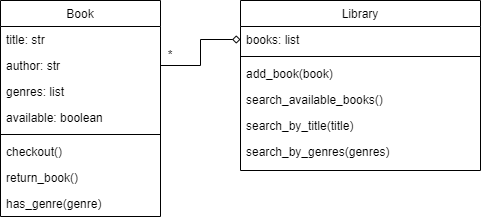

# Data Processing and Representations Exam

This is a digital exam. The exam consists of programming exercises that are purely based on input, output, and calculations. You will use these exercises to show that you can write a data processing program from scratch using tools covered in this course.

During the exam, **you are allowed use the internet and the code you have written for the PDP and DPR modules**. You are obviously not allowed to message other students, so make sure any and all messaging applications are closed for the entire duration of the exam. You are also not allowed to use ChatGPT or similar tools that can write code for you. The only allowed tools are an editor with your code, possibly with code from earlier assignments, your terminal and a browser for searching for other coding resources and documentation.

_You will not be graded on design, but only on the correctness of your code_ and whether you met the requirements. You do not have to comment your code, nor do you have to abide by any other styling rules (though this can greatly help you understand your code).

This exam consists of 3 parts. Each of the parts can be made separately and are fully independent of each other.

## Rules

- Finish all exercises in a file named `exam.py` and submit this file
- Define any functions and/or classes you write at the top of the file, and add the provided tests at the bottom of the file in order of the exercises.
- Make sure the provided tests are *all* printed (or shown) when running your program. Separate the prints for each exercise with an extra print like `print("\n=== Exercise 1 ===")`, so it is clear which output belongs to which exercise.
- Not all exercises need to be perfect to pass the exam. If you do not know how to proceed, describe what you want your code to do.
- You are allowed use the internet and the code you have written for the PDP and DPR modules
- You are *not* allowed to contact other students
- You are *not* allowed to use ChatGPT or similar tools that can write code for you.

*Before you leave the exam room, check with us that your submission was correctly submitted!*

# The Exam

## Part 1: OOP

You are tasked with creating a simple library management system. You will implement two classes: `Book` and `Library`. The `Book` class represents a book in the library and contains information such as the book's title, author, genres, and availability status. The `Library` class serves as a container for a collection of books and implements methods to add books to the library, check out a book, return a book, and search for books based on different criteria.

The following UML describes these classes and their relation:

Implement `Book` with the following methods:

- `__init__(title, author, genres)`: create a new instance with the information provided by the parameters. The book should be marked as available.
- `checkout()`: if the book is available, this method marks the book as checked out (set the `available` attribute to `False`). If the book is not available, an error message is printed.
- `return_book()`: if the book is not available, this method marks the book as available (set the `available` attribute to `True`). If the book is already available, an error message is printed.
- `has_genre(genres_list)`: returns `True` if the book has at least one of the given `genres_list` in its `genres`, and returns `False` otherwise (i.e. there are no matches with `genres` at all).

For a reference of the error message, see the output of the example below.

Implement `Library` with the following methods:

- `add_book(book)`: adds a `Book` instance to the library's collection of books
- `search_available_books()`: searches for all available books in the library and returns a list of `Book` instances.
- `search_by_title(title)`: searches for a book in the library that matches the given title exactly and returns a `Book` instance. If no book is found, `f'The book "{title}" was not found.'` is printed and `None` is returned.
- `search_by_genres(genres)`: searches for books that have at least one of the genres in the list `genres` and returns a list of `Book` instances. Make sure that every book is only listed once!
<!-- - `search_by_author(author)`: searches for books in the library based on the given author and returns a list of `Book` instances. -->

Have a look at this example:

    # Create books
    book1 = Book('Python for Beginners', 'Timothy C. Needham', ['Programming', 'Learning', 'Science'])
    book2 = Book('Call of Cthulhu', 'Howard Phillips Lovecraft', ['Horror', 'Fantasy', 'Detective'])
    book3 = Book('Elantris', 'Brandon Sanderson', ['Fantasy', 'Science fiction', 'Roman'])
    book4 = Book('Pattern Recognition and Machine Learning', 'Christopher M. Bishop', ['Maths', 'Learning', 'Science', 'Horror'])

    book1.checkout()
    print(f'{book1.title} has available set to {book1.available}')
    book1.checkout() # this should give an errror

    book1.return_book()
    print(f'{book1.title} has available set to {book1.available}')
    book1.return_book() # this should also give an error

    genres_list = ['Science fiction', 'Detective', 'Fantasy']
    has_match = book3.has_genre(genres_list)
    if has_match:
      print(f'\n{book3.title} has at least one of the following genres: {genres_list}')
    else:
      print(f'\n{book3.title} has none of the following genres: {genres_list}')

    has_match = book4.has_genre(genres_list)
    if has_match:
      print(f'{book4.title} has at least one of the following genres: {genres_list}')
    else:
      print(f'{book4.title} has none of the following genres: {genres_list}')

    # Create library
    library = Library()

    # Add books to the library
    for book in [book1, book2, book3, book4]:
        library.add_book(book)

    # Search for available books
    book1.checkout()
    available_books = library.search_available_books()
    print('\nAvailable Books:')
    for book in available_books:
        print(f'\tBook "{book.title}" is available')

    # Search for books by title
    found_book = library.search_by_title('Python for Beginners')
    print(f'\nWe found the book "{found_book.title}" by {found_book.author}')
    library.search_by_title('Non-existing-book-title')

    # Search for books by genre
    genres = ['Learning', 'Detective', 'Science']
    found_books = library.search_by_genres(genres)
    print(f'\nSearch Results for genres {genres}:')
    for book in found_books:
        print(f'\tBook "{book.title}" by {book.author}')

Which should give the following result:

    Python for Beginners has available set to False
    ERROR: The book "Python for Beginners" by Timothy C. Needham was already checked out!
    Python for Beginners has available set to True
    ERROR: The book "Python for Beginners" by Timothy C. Needham was already returned!

    Elantris has at least one of the following genres: ['Science fiction', 'Detective', 'Fantasy']

    Pattern Recognition and Machine Learning has none of the following genres: ['Science fiction', 'Detective', 'Fantasy']

    Available Books:
        Book "Call of Cthulhu" is available
        Book "Elantris" is available
        Book "Pattern Recognition and Machine Learning" is available

    We found the book "Python for Beginners" by Timothy C. Needham
    The book "Non-existing-book-title" was not found.

    Search Results for genres ['Learning', 'Detective', 'Science']:
        Book "Python for Beginners" by Timothy C. Needham
        Book "Call of Cthulhu" by Howard Phillips Lovecraft
        Book "Pattern Recognition and Machine Learning" by Christopher M. Bishop

## Part 2: Pandas

For this assignment you need to use the file [sales.csv](sales.csv). This file contains data about sales transactions and looks as follows:

    transaction_id,product_name,quantity,price,customer_id
    1001,Product A,5,10.99,C001
    1002,Product B,2,24.99,C002
    1003,Product C,1,49.99,C003
    ...
    1160,Product C,2,49.99,C003
    1161,Product D,1,79.99,C005
    1162,Product E,2,99.99,C107

As you can see, the file has a header, and the data fields are separated by comma's. The different datafields contain the following information:

1. `transaction_id`: the unique identifier of the transaction
2. `product_name`: the name of the product sold
3. `quantity`: the quantity of the product sold
4. `price`: the price of each unit of the product
5. `customer_id`: the unique identifier of the customer

### Exercise 1

Load the data into a `DataFrame` named `df` using `pandas`. Print the dataframe and make sure your result has 162 rows and 5 columns.

         transaction_id product_name  quantity  price customer_id
    0              1001    Product A         5  10.99        C001
    1              1002    Product B         2  24.99        C002
    2              1003    Product C         1  49.99        C003
    3              1004    Product A         3  10.99        C001
    4              1005    Product B         4  24.99        C004
    ..              ...          ...       ...    ...         ...
    157            1158    Product A         4  10.99        C105
    158            1159    Product B         3  24.99        C106
    159            1160    Product C         2  49.99        C003
    160            1161    Product D         1  79.99        C005
    161            1162    Product E         2  99.99        C107

    [162 rows x 5 columns]

### Exercise 2

Now that the `DataFrame` has been loaded, we will do some data transformations.

Create a new `DataFrame` named `product_sales` that, for every `product` in the dataset, shows the total number of sales for that product.

Your result should look something like this:

    product_name
    Product A    85
    Product B    91
    Product C    56
    Product D    33
    Product E    91
    Product F    57
    Name: quantity, dtype: int64

Calculate the total sales for each product and store the result in a pandas `Series` named `product_sales`, where the index represents the product name and the values represent the total sales for that product.

### Exercise 3

Calculate the total revenue generated from all sales and assign it to the variable `total_revenue`. Round the number to two decimals. Print your answer in the following format:

    The total revenue was $26295.87

> Hint: It might be easier to create a new column in your dataframe that holds the revenue for each transaction, and then calculate the total revenue from there.

### Exercise 4

Create a new `Series` named `customer_item_counts` that, for every `'customer_id'` in the dataset, calculates the total number of items that was purchased by that customer.

    customer_id
    C001    22
    C002    27
    C003    36
    C004     4
    C005    13
            ..
    C103     5
    C104     2
    C105     4
    C106     3
    C107     2
    Name: quantity, Length: 107, dtype: int64

### Exercise 5

Using `customer_item_counts` from the previous exercise, find the top 5 customers who purchased the most items by ordering from highest to lowest total purchases and print the result.

Your result should look something like this:

    customer_id
    C003    36
    C002    27
    C001    22
    C009    16
    C005    13
    Name: quantity, dtype: int64

## Part 3: Built-in data structures

You are tasked with creating a concert database that keeps track of concerts scheduled at different venues. You have a dictionaries of venues with their available seats and a list of upcoming concerts.

    venue_seats = {'Tivoli': [('VIP', 'A1'), ('VIP', 'A2'), ('General', 'B1'), ('General', 'B2'), ('General', 'B3'), ('General', 'B4')],
                'Ahoy': [('VIP', 'A1'), ('VIP', 'A2'), ('VIP', 'A3'), ('General', 'B1'), ('General', 'B2'), ('General', 'C1'), ('General', 'C2'), ('General', 'D1'), ('General', 'D2')],
                'Ziggo Dome': [('General', 'A1'), ('General', 'B1'), ('General', 'C1'), ('General', 'D1')]}

    concerts = [('Backstreet Boys', 'Ahoy', '11-02-2024'),
                ('Backstreet Boys', 'Tivoli', '12-02-2024'),
                ('Backstreet Boys', 'Ziggo Dome', '13-02-2024'),
                ('Golden Earring', 'Ahoy', '18-02-2024'),
                ('Greenday', 'Ziggo Dome', '18-02-2024')]

### Exercise 1

Your goal is to populate a concert database with concert details and the available tickets.

Write a function `initialize_concert_database(concerts)` that creates a dictionary named `concert_database` using information from the list of `concerts`. The dictionary `concert_database` has keys which are tuples containing concert details in the following order: `venue`, `band_name`, and `date`. The value for each key should be an empty list for now.

Call the function as follows:

    concert_database = initialize_concert_database(concerts)
    print(concert_database)

When done correctly you will end up with `concert_database` looking as follows:

    {('Ahoy', 'Backstreet Boys', '11-02-2024'): [],
      ('Tivoli', 'Backstreet Boys', '12-02-2024'): [],
      ('Ziggo Dome', 'Backstreet Boys', '13-02-2024'): [],
      ('Ahoy', 'Golden Earring', '18-02-2024'): [],
      ('Ziggo Dome', 'Greenday', '18-02-2024'): []
    }

### Exercise 2

We will now fill each of the lists in `concert_database` with the tickets that are available for a venue.

Write a function `populate_concert_database(concert_database, venue_seats)` that takes a `concert_database` that is initialized and populates the lists for each concert with the available tickets for the venue using information from `venue_seats`.

Every ticket should be structured as follows: `(name, ticket_type, seat_number)`. A ticket that is not sold should have `None` entered for its name. You can assume that each ticket starts out unsold, so each ticket will have `None` as it's `name` for now.

Update the `concert_database` dictionary to include the available tickets for each concert. The tickets should be added as a list to the corresponding concert key.

After running the following:

    concert_database = populate_concert_database(concert_database, venue_seats)
    print(concert_database)

Your `concert_database` should now be:

    {('Ahoy', 'Backstreet Boys', '11-02-2024'):
          [(None, 'VIP', 'A1'), (None, 'VIP', 'A2'), (None, 'VIP', 'A3'), (None, 'General', 'B1'), (None, 'General', 'B2'), (None, 'General', 'C1'), (None, 'General', 'C2'), (None, 'General', 'D1'), (None, 'General', 'D2')],
      ('Tivoli', 'Backstreet Boys', '12-02-2024'):
          [(None, 'VIP', 'A1'), (None, 'VIP', 'A2'), (None, 'General', 'B1'), (None, 'General', 'B2'), (None, 'General', 'B3'), (None, 'General', 'B4')],
      ('Ziggo Dome', 'Backstreet Boys', '13-02-2024'):
          [(None, 'General', 'A1'), (None, 'General', 'B1'), (None, 'General', 'C1'), (None, 'General', 'D1')],
      ('Ahoy', 'Golden Earring', '18-02-2024'):
          [(None, 'VIP', 'A1'), (None, 'VIP', 'A2'), (None, 'VIP', 'A3'), (None, 'General', 'B1'), (None, 'General', 'B2'), (None, 'General', 'C1'), (None, 'General', 'C2'), (None, 'General', 'D1'), (None, 'General', 'D2')],
      ('Ziggo Dome', 'Greenday', '18-02-2024'):
          [(None, 'General', 'A1'), (None, 'General', 'B1'), (None, 'General', 'C1'), (None, 'General', 'D1')
    ]}

### Exercise 3

Now let's simulate the sale of tickets! Write a function called `sell_ticket(concert_database, concert, seat_number, name)` that takes the `concert_database` dictionary, a `concert` tuple representing the concert details, a `seat_number` indicating the seat to be sold, and a `name` string representing the name of the person buying the ticket.

The function should update the `concert_database` dictionary by replacing the `None` value in the ticket with the provided name.

For example, if we call the function as follows:

    concert = ('Ahoy', 'Backstreet Boys', '11-02-2024')
    seat_number = 'A3'
    name = 'Jan Janssen'

    sell_ticket(concert_database, concert, seat_number, name)

    seat_number = 'C1'
    name = 'Bart Bakker'
    sell_ticket(concert_database, concert, seat_number, name)

    # Print the tickets for a specific concert
    print(concert_database[concert])

The following should be printed:

    [(None, 'VIP', 'A1'), (None, 'VIP', 'A2'), ('Jan Janssen', 'VIP', 'A3'), (None, 'General', 'B1'), (None, 'General', 'B2'), ('Bart Bakker', 'General', 'C1'), (None, 'General', 'C2'), (None, 'General', 'D1'), (None, 'General', 'D2')]
