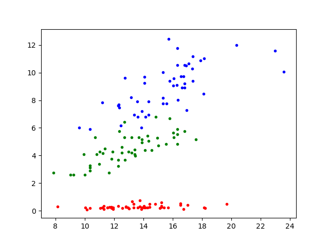
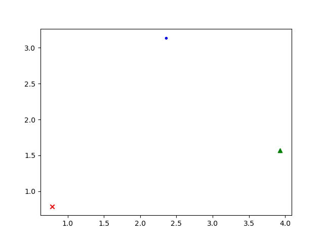
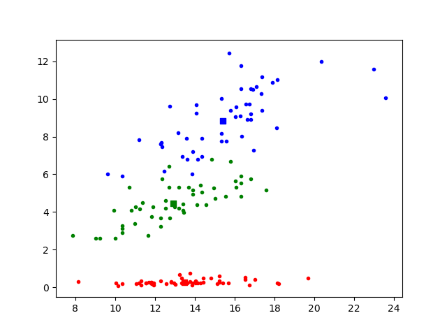

# Data Processing and Representations Practice Exam

This is a digital exam. The exam consists of programming exercises that are purely based on input, output, and calculations. You will use these exercises to show that you can write a data processing program from scratch using tools covered in this course.

During the exam, you are allowed use the internet and the code you have written for the PDP and DPR modules. You are obviously not allowed to message other students, so make sure any and all messaging applications are closed for the entire duration of the exam. The only allowed tools are an editor with your code, possibly with code from earlier assignments, your terminal and a browser for searching for other coding resources and documentation.

_You will not be graded on design, but only on the correctness of your code_ and whether you met the requirements. You do not have to comment your code, nor do you have to abide by any other styling rules (though this can greatly help you understand your code).

This exam consists of 3 parts. Each of the parts can be made separately and are fully independent of each other.

## Rules

- Finish all exercises in a file named `exam.py` and submit this file
- Define any functions and/or classes you write at the top of the file, and add the provided tests at the bottom of the file in order of the exercises.
- Make sure the provided tests are *all* printed (or shown) when running your program. Separate the prints for each exercise with an extra print like `print("\n=== Exercise 1 ===")`, so it is clear which output belongs to which exercise.
- Not all exercises need to be perfect to pass the exam. If you do not know how to proceed, describe what you want your code to do.

*Before you leave the exam room, check with us that your submission was correctly submitted!*

# The exam

> Please note that this practice exam is not entirely representative of the upcoming final exam. This practice exam consists of a series of sequential questions while the final exam will consist of three seperate individual parts. The difficulty of the questions and the topics at hand _are_ representative of the final exam. The three topics will be the 3 different ways you've seen to represent data and process it:
>
> - Classes and object instances
> - Panda's Dataframes and Series
> - Combinations of built-in data structures like *lists* and *dictionaries*.
>
> For more information refer to the final exam announcement.

The Iris data set contains 3 classes of 50 instances each, where each class refers to a type of iris plant. For each instance, the attributes sepal length, sepal width, petal length, petal width, and species are available. The dataset has no missing values.

The goal of this exam is to design several transformations that will construct new features for this data set, and see if these new features might make it easier for a machine learning model to learn to separate the different species of iris flower. The overall pipeline you'll be working on is to read in the data, construct a representation, apply the transformations, and then visualize the results. Each of the 10 exercises below corresponds to a single step of this process.

## Exercise 1 - Reading the data

[Download the `iris.csv` for this exam here](data/iris.csv) and read it using Pandas. Print the first 5 rows of the dataframe holding all data.

The output of this part of your program should be:

    sepal_length  sepal_width  petal_length  petal_width species
    0           5.1          3.5           1.4          0.2  setosa
    1           4.9          3.0           1.4          0.2  setosa
    2           4.7          3.2           1.3          0.2  setosa
    3           4.6          3.1           1.5          0.2  setosa
    4           5.0          3.6           1.4          0.2  setosa

## Exercise 2 - Calculating the area of an ellipse

We're going to try to combine the width and length features of petals or sepals together into a new feature. This feature will be area of the petal or sepal, which we'll approximate using an ellipse.

Create a function `compute_area()`, that, given a length ($$L$$) and a width ($$W$$), can estimate the area of that ellipse. The equation for the area of an ellipse is $$0.5 * L * 0.5 * W * \pi$$. The output of the function should be a floating point number, which has been rounded to two decimals. Test the function with:

    print(compute_area(2, 4))

Which should print:

    6.28

## Exercise 3 - Creating the `Flower` class

Create a class named `Flower` that can store the attributes sepal length, sepal width, petal length, petal width, and species. For now, the class only needs to consist of an initialization function.

    first_flower = Flower(5.1, 2.5, 1.8, 0.2, 'setosa')
    print(f'The species of this flower is {first_flower.species} and it has a petal length of {first_flower.petal_length}')

Which should print:

    The species of this flower is setosa and it has a petal length of 1.8

## Exercise 4 - Creating Flower instances

Transform each of the 150 rows in the data set you've loaded in exercise 1 into 150 separate `Flower` instances and add them to a list named `flowers`.

    print(f'There are {len(flowers)} flowers')
    print(f'The species of the last flower is: {flowers[-1].species}')

Which should print:

    There are 150 flowers
    The species of the last flower is: virginica

## Exercise 5 - Computing areas

Modify your `Flower` class from before by adding a new _method_ named `compute_sepal_petal_areas()` that calculates the  `sepal_area` and `petal_area`, and store them as attributes of the instance. Use your `compute_area()` function!

Iterate over `flowers`, and compute the sepal and petal areas for each of the flowers in the list. Thereafter, run the following test:

    print(f'The area of the Sepal for the second flower  is: {flowers[1].sepal_area}')
    print(f'The area of the Petal for the second flower is: {flowers[1].petal_area}')

Which should print:

    The area of the Sepal for the second flower  is: 11.55
    The area of the Petal for the second flower is: 0.22

## Exercise 6 - Plotting individual Flower instances

Add another method to your `Flower` class named `plot_area()`. This method should plot a single dot for each `Flower` instance, with the area of the sepal on the horizontal axis and the area of the petal on the vertical axis. This method should **not** show the resulting plot yet, so multiple flowers can be added to the plot together. The color of the dot drawn in the plot should be based on the `species` attribute of that specific `Flower`:

- "setosa" should be red
- "versicolor" should be green
- "virginica" should be blue

Recreate the plot below by calling the `plot_area()` method for all Flower instances. Remember to use `plt.show()` as the _last_ step to show the resulting figure with _all_ flowers plotted together.

## Exercise 7 - Calculating the average of each species

Next, we're going to try and see what these features look like for the average iris flower of each of the species.

Using the dataframe from exercise 1, create and print a dataframe that holds the average sepal length, sepal width, petal length, and petal width for each of the three species in the dataset.

The output of this part of your program should be:

                sepal_length  sepal_width  petal_length  petal_width
    species
    setosa             5.006        3.428         1.462        0.246
    versicolor         5.936        2.770         4.260        1.326
    virginica          6.588        2.974         5.552        2.026

## Exercise 8 - Create average flowers

Transform each of the rows in the dataframe with the average values for each of the species into `Flower` instances. Add the three average instances to a separate list named `avg_flowers` and call `compute_sepal_petal_areas()` for all instances.

    print(f'There are {len(avg_flowers)} average flowers')
    print(f'The species of the last average flower is: {avg_flowers[-1].species}')
    print(f'The area of the Sepal for the second average flower is: {avg_flowers[1].sepal_area}')
    print(f'The area of the Petal for the second average flower is: {avg_flowers[1].petal_area}')

Which should print:

    There are 3 average flowers
    The species of the last average flower is: virginica
    The area of the Sepal for the second average flower is: 12.91
    The area of the Petal for the second average flower is: 4.44

## Exercise 9 - Plotting different markers

Adjust your `Flower.plot_area()` method such that it can accept an _optional_ argument `marker`.

**Hint:** set the default value for marker to a **dot** (`'.'`) in the method definition, so all your code from before (which plotted dots), still works without modification!

    first_flower = Flower(1, 1, 1, 1, 'setosa')
    second_flower = Flower(1, 5, 1, 2, 'versicolor')
    third_flower = Flower(3, 1, 2, 2, 'virginica')

    first_flower.compute_sepal_petal_areas()
    second_flower.compute_sepal_petal_areas()
    third_flower.compute_sepal_petal_areas()

    first_flower.plot_area(marker='x')
    second_flower.plot_area(marker='^')
    third_flower.plot_area()

    plt.show()

Should produce the following figure:

## Exercise 10 - Add the average flowers to plot as squares

Start by calling the `plot_area()` method for each of the Flower instances in the original list of `flowers`, using the default dot markers. Next, for each of the average `Flower` instances, call the `plot_area()` method, but set the marker to a square: `marker='s'`, and show the result. The combined plot showing the average areas together with original flower area's for each species, should look like the plot below:

