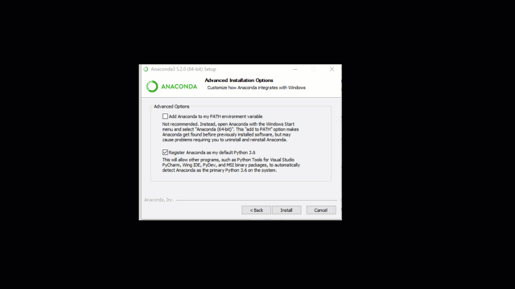

# Preparations

Welcome to Data Processing. We will be using a variety of tools, which will
require some initial configuration. While some of this will likely be dull,
doing it now will enable us to do more exciting work in the weeks that follow
without getting bogged down in further software configuration.

# Python on your own computer

To be able to program on your own computer you need two different programs: the interpreter itself and a good editor:

1. **Anaconda**, a version of Python that is easy to install. There are *a lot* of packages included, which contain functionalities for graphs, statistics and a host of other features.

2. **Visual Studio Code**, an *editor* to write code in. This is, in a way, just a text writing program, but specifically meant for programming code. For example, it highlights particular parts of your code in specific colours, so you maintain oversight over your code.

Stuck? Consult an assistant!

### Step 1: Anaconda

This package can be downloaded at their [website](https://www.anaconda.com/download/). Choose to download the "**Graphical Installer**" for the latest **Python-version**. The download is over 500MB, so it could take a while before it's done! You do not need to provide your mail address, even without it you're allowed to use Anaconda.

As soon as the download is finished, you have to execute the downloaded file (double click). Follow the installation instructions and choose "Install for me only" where you can; if everything is okay you don't need to alter anything else.

Note: for Windows always choose the "advanced" installation and tick the following box! If you did not, you have to reinstall anaconda!

The installation can take a while.

{:style="max-width:25%"}

### Step 2: Visual Studio Code

This package can be downloaded at their [website](https://code.visualstudio.com/download). Once again you have to execute the downloaded file. This time though you do not have to alter any settings during the installation process. Do you have a Mac? Just move the file to your applications folder. From there you can simply run it.

## Testing

Now that you have installed both Anaconda and Visual Studio Code, we can see if everything runs smoothly. Follow the examples from the video:

### Terminal

In Visual Studio Code you can open a terminal with the key combination **ctrl**+**\`**. That means pressing both **ctrl** and **\`** (this key is often found next to the 1 or the Z key on your keyboard) at the same time.

## Installing the required Libraries

If you have installed Anaconda, all libraries necessary for this course should already be installed.

You can see installed packages by executing `conda list` in your terminal.

## Executing Python Code

Being an interpreted language, Python requires an interpreter to execute a script. You’ve already executed a script for the BeautifulSoup installation! The interpreter is called by typing python at the command line. If a file is passed as the first argument (e.g., `python myfile.py`), the interpreter will execute the specified script. If no parameters are given, the interpreter will launch in interactive mode where you can type individual commands one at a time. In general, most things that can be done via script can be done in interactive mode. However, in practice, scripts are more common.

Therefore the process is: you edit a file, e.g., `hello_world.py` in the editor of your choice (Atom, Sublime Text 3, Emacs, Notepad++, or a complete IDE like PyDev), and then run python and give your script as a parameter. Here is a simple example.

	import math

	letter = math.ceil(math.pow(3, 2) * 11 - 2)
	print("Hello World, and welcome to D" + chr(letter) + "t" + chr(letter) + "!")

<!-- If this code example does not run on your machine, a common cause (if you use Windows) is that the environment variables of your operating system are not correctly set. If you follow along with these [instructions](https://superuser.com/questions/143119/how-do-i-add-python-to-the-windows-path) you can change your environment variables. -->

To get your feet wet with python go through [this](https://docs.python.org/3/tutorial/introduction.html) and [this](https://docs.python.org/3/tutorial/controlflow.html) page of the python
tutorial and play around with strings, lists, control flow, functions, etc.

## Check whether BeautifulSoup is correctly installed

Copy the following code to a script and run it with python:

  from bs4 import BeautifulSoup

	html_doc = """
    <html><head><title>The Dormouse's story</title></head>
    <body>
    
<b>The Dormouse's story</b>

    
Once upon a time there were three little sisters; and their names were
    <a href="http://example.com/elsie" class="sister" id="link1">Elsie</a>,
    <a href="http://example.com/lacie" class="sister" id="link2">Lacie</a> and
    <a href="http://example.com/tillie" class="sister" id="link3">Tillie</a>;
    and they lived at the bottom of a well.

    
...

    """
  soup = BeautifulSoup(html_doc, 'html.parser')

  print(soup.title)

If you get output similar to this, everything is fine:

	$ python bs4_test.py
	# <title>The Dormouse's story</title>

If this is not the case, there are several fixes described on the documentation website. If you’re still having trouble getting things to work just ask for help.
